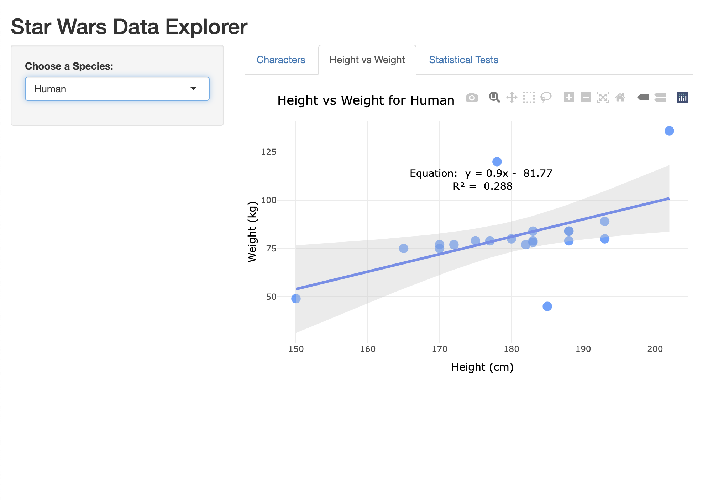
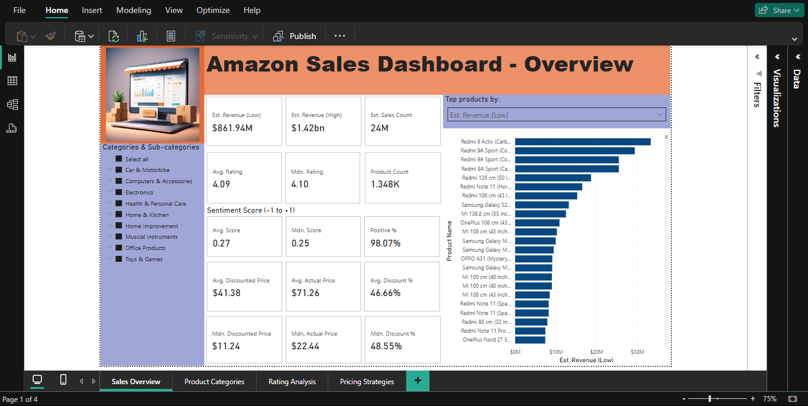
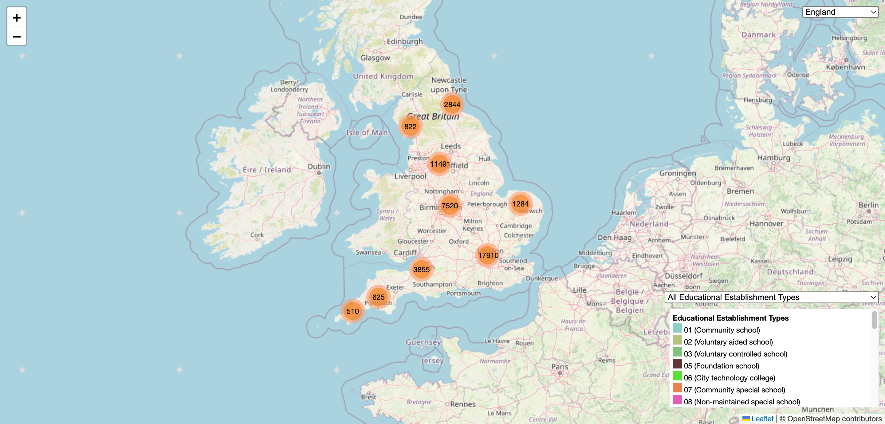

# personal-projects
My Personal Projects

Welcome to my Personal Projects Hub! This is a one-stop destination for exploring all of my personal GitHub projects. Here, you’ll find a diverse range of repositories, from innovative experiments to fully functional applications. Whether you’re looking to collaborate, learn, or simply browse, you’ll find everything organised and easy to navigate. Each project is accompanied by detailed documentation to help you get started quickly. Explore and dive into the code!

This page features:
- Summaries of each project.
- Direct links to the corresponding GitHub repositories for detailed exploration.
- Screenshots illustrating the outputs and methodologies employed.
- A breakdown of the key skills demonstrated in each task.

## Contents
1. [Data Projects](#1-data-projects)
    - [uob-data-bootcamp](#uob-data-bootcamp) - University of Birmingham Data Analytics Bootcamp Assignments Hub 
    - [starwars-data-explorer](#starwars-data-explorer) - R Shiny App to Explore Star Wars Characters
    - [amazon-sales-dashboard](#amazon-sales-dashboard) - Power BI Visualisation on Amazon Sales Data
    - [educational-establishments](#educational-establishments) - Web project visualising educational establishments across England

2. [Other Projects](#2-other-projects)
    - [llm-rag](#llm-rag) - AI-Powered Multi-Mode RAG App

3. [Other Links](#3-other-links)

---

# 1. Data Projects

## uob-data-bootcamp
University of Birmingham Data Analytics Bootcamp Assignments Hub

**Overview:**

This repository highlights the journey of my October 2023 cohort through:
- 4 capstone projects that demonstrate practical, real-world data analysis applications.
- 17 challenges designed to strengthen analytical skills and problem-solving capabilities.
  
**URL:** [https://github.com/bernardtse/uob-data-bootcamp](https://github.com/bernardtse/uob-data-bootcamp)

**Skills:** Refer to individual projects.

---

## starwars-data-explorer
R Shiny App to Explore Star Wars Characters

**Overview:**

Star Wars Data Explorer an interactive Shiny app designed to allow users to explore and analyse various characteristics of Star Wars characters, including their species, sex, height and weight. The app provides several features such as visualising the relationship between height and weight, and conducting chi-squared tests to explore correlations among sex, height and weight.

This project aims to make Star Wars data more accessible and engaging through dynamic visualisations and statistical tests. By filtering the dataset based on species and analysing relationships, users can dive deeper into the characteristics of their favourite characters.
  
**URL:** [https://github.com/bernardtse/starwars-data-explorer](https://github.com/bernardtse/starwars-data-explorer)

**Skills:** R, Shiny, dplyr, tidyr, ggplot2, plotly

---

## amazon-sales-dashboard
Power BI Visualisation on Amazon Sales Data

**Overview:**

This project contains the Power BI visualisations for analysing the [Amazon Sales Dataset](https://www.kaggle.com/datasets/karkavelrajaj/amazon-sales-dataset) sourced from Kaggle. The dataset consists of over 1,000+ products scraped from Amazon India in January 2023, including details on product categories, ratings, prices, and reviews.

The goal of this project is to provide insights into sales estimates, revenue projections, pricing strategies, and category performance using interactive Power BI dashboards.
  
**URL:** [https://github.com/bernardtse/amazon-sales-dashboard](https://github.com/bernardtse/amazon-sales-dashboard)

**Skills:** Power BI, Python, pandas, TextBlob

---

## educational-establishments

**Overview:**

This project visualises educational establishments in England through **three separate web pages**, one for each data format: **JSON**, **GeoJSON**, and **CSV**.  
Each page provides the same interface and functions, allowing users to explore and compare how different data types can be fetched and visualised on an interactive map.  

**URL:** [http://github.com/bernardtse/educational-establishments](http://github.com/bernardtse/educational-establishments)

**Skills:** HTML, CSS, JavaScript, Leaflet.js

---

# 2. Other Projects

## llm-rag
AI-Powered Multi-Mode RAG App

**Overview:**

This project provides a Python application built using `Streamlit`, `ChromaDB`, and `Ollama`. It allows users to upload multiple file formats (TXT, MD, PDF, DOCX, ODT, RTF), scrape web pages, and perform queries on extracted content using powerful large language models (LLM).

This repository simplifies the process of extracting text content from various documents and webpages, storing it in a vector database (ChromaDB), and using AI models for retrieval-augmented generation (RAG) to enhance querying accuracy.
  
**URL:** [https://github.com/bernardtse/llm-rag](https://github.com/bernardtse/llm-rag)

**Skills:** Python, BeautifulSoup, LangChain, ChromaDB, Ollama, Streamlit

# 3. Other Links
- Data Analytics Portfolio: [https://bernardtse.github.io](https://bernardtse.github.io)
- LinkedIn Profile: [https://www.linkedin.com/in/tsebernard](https://www.linkedin.com/in/tsebernard)